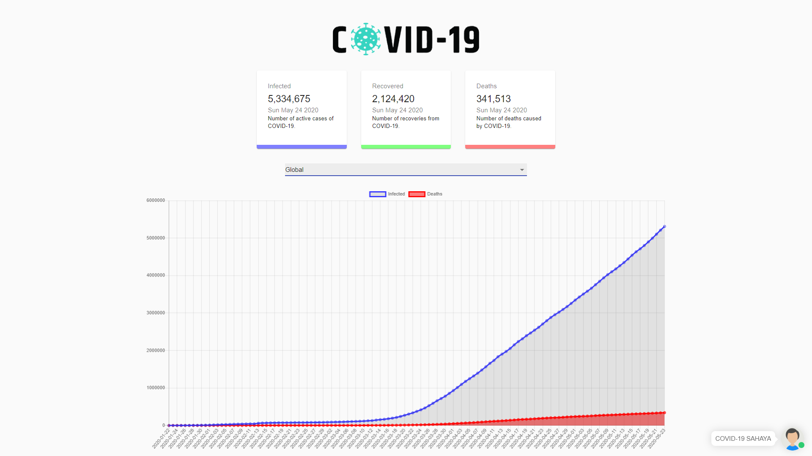

# 12HR-HACKATHON-SMARTER-SOLUTIONS-TO-FIGHT-COVID-19

LINK TO THE VIDEO EXPLAINATION:   https://drive.google.com/drive/folders/1vJjHIw5QS5prw2i3jis4CX57lGgxfCaU

This is Web based application(JS, HTML, CSS).
Make sure to install the node modules with the following command: run
          
    npm i && npm start

Then npm start to run the application.

    npm start

=> CASE 1: GLOBAL VIEW

=> CASE 2: COUNTRY VIEW(US SELECTED))

=> COUNTRY VIEW(INDIA SELECTED) WITH CHATBOT

=> CERTIFICATE OF APPRECIATION (WON)

